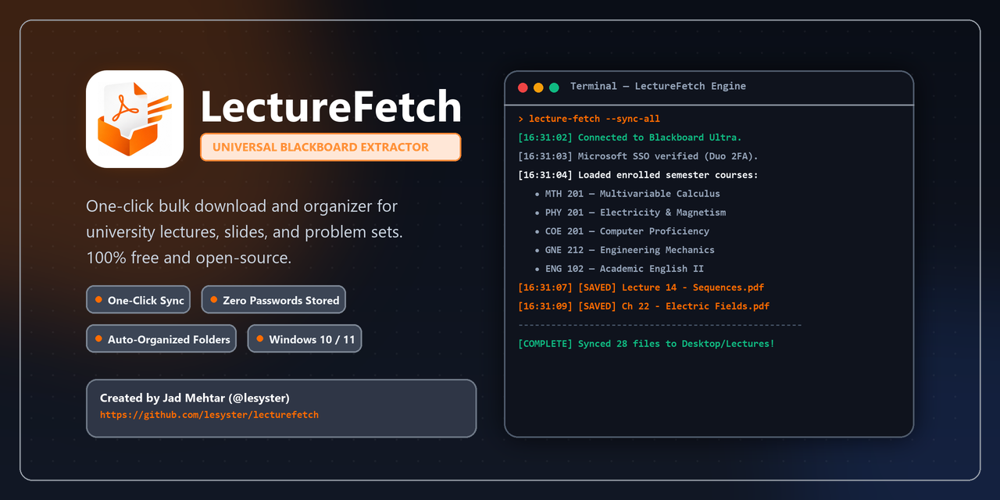

# 🎓 LectureFetch — Automated Blackboard Lecture Extractor

<p align="center">
  
</p>

<p align="center">
  <a href="https://github.com/lesyster/lecturefetch/releases/latest/download/LectureFetch.exe">
    
  </a>
  <a href="https://lesyster.github.io/lecturefetch/">
    
  </a>
  <a href="https://github.com/lesyster/lecturefetch/releases">
    
  </a>
</p>

---

## ⚡ What is LectureFetch?
**LectureFetch** is a lightweight, 100% free open-source desktop application for university students running **Blackboard Learn Ultra**. Instead of clicking through 50 individual PDF and slide links the night before an exam, LectureFetch discovers your enrolled courses and extracts all lecture slides, syllabi, and problem sets into cleanly organized folders on your computer in **one click**.

---

## 🚀 Download & Installation

1. Click the button below to download the latest Windows standalone executable:
   👉 **[Download LectureFetch.exe (v1.1.0)](https://github.com/lesyster/lecturefetch/releases/latest/download/LectureFetch.exe)**
2. Double-click **`LectureFetch.exe`** on your Desktop or Downloads folder.
3. No installation or setup required — it runs immediately!

---

## 🛡️ Privacy & Security (How It Works)

- **Zero Credentials Stored:** You never enter your student ID or password into LectureFetch.
- **Official Browser Launch:** Clicking **"Connect Account"** launches your real Microsoft Edge (or Chrome/Brave) directly to the official university portal with Duo 2FA.
- **DPAPI Encryption:** Your temporary session ticket is encrypted on your machine using **Windows DPAPI** (`CryptProtectData`).
- **100% Local:** Files are saved directly to your chosen desktop folder (`Desktop\Lectures`). Zero files or data are uploaded anywhere.

---

## 📂 Features

- **⚡ One-Click Bulk Extraction:** Recursively finds all course content and downloads them simultaneously.
- **🔄 Smart Incremental Sync:** Automatically skips files you already have. Never downloads duplicates.
- **📁 Collision-Safe Folders:** Defaults to `Desktop\Lectures` (or `Desktop\Extracted Lectures` if an archive already exists).
- **🎓 Works for Any Major:** Dynamically discovers registered courses across Engineering, Business, Arts, Sciences, and Medicine.

---

## 🛠️ Running from Source (Developers)

If you have Python installed and want to inspect or run directly from source:

```bash
# 1. Clone the repository
git clone https://github.com/lesyster/lecturefetch.git
cd lecturefetch/app

# 2. Install dependencies
pip install -r requirements.txt

# 3. Launch application
python app.py
```

### 📦 Building the Standalone `.exe` with PyInstaller

```bash
cd lecturefetch/app
pip install pyinstaller
python -m PyInstaller --clean LectureFetch.spec
```

---

## 📂 Repository Structure

```text
lecturefetch/
├── app/               # Standalone application source & PyInstaller build spec
│   ├── app.py             # CustomTkinter modern desktop GUI
│   ├── core_engine.py     # CDP browser attach & Blackboard REST sync engine
│   ├── requirements.txt   # Python dependencies
│   ├── LectureFetch.spec  # PyInstaller packaging configuration
│   ├── logo_rounded.png   # Application UI badge
│   └── app_icon.ico       # Executable Windows application icon
│
├── website/           # Landing page website & assets
│   ├── index.html         # Official web landing page
│   ├── logo.png           # Branding assets
│   ├── social-card.png    # GitHub social preview card
│   └── favicon.png        # Website favicon
│
└── README.md          # Comprehensive user manual, privacy guide & releases
```

---

## 🧡 Support the Project

Like this tool? Feel free to help out:
- **Wish Money:** `+961 70 007 193` *(Jad Mehtar)*

---

## 👤 Author

Developed with 🧡 by **Jad Mehtar** ([@lesyster](https://github.com/lesyster))  
Computer Engineering student.
